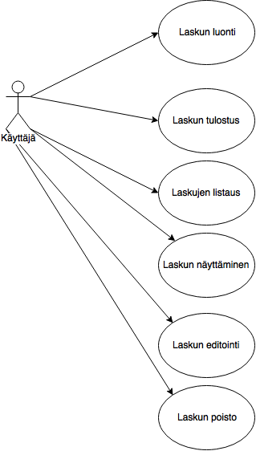
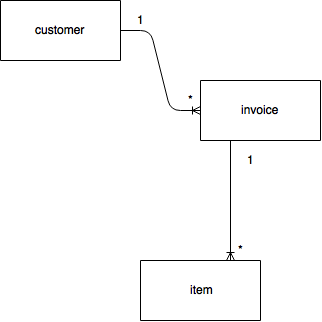
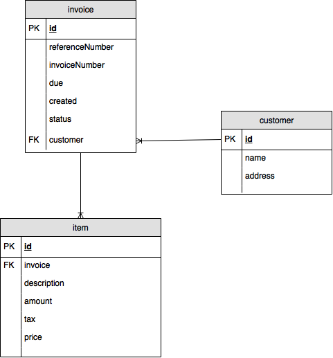

# Invoicing-laskutusjärjestelmän dokumentaatio

Invoicing on www-pohjainen laskutusjärjestelmä, jolla on helppoa luoda uusia laskuja ja tulostaa niitä asiakkaille.

Järjestelmä on pienyrityksen käyttöä varten luotu ja siten sen ominaisuudet on varsin pienet, mutta riittävät, sillä laskutuksessa olisi tarkoitus käyttää mahdollisimman vähän aikaa.

## Järjestelmävaatimukset

### Palvelimen järjestelmävaatimukset

- PHP 5.6
- PostgreSQL 9.4

### Käyttäjän järjestelmävaatimukset

Käyttäjän selain kuuluu olla nykyaikainen ns. HTML5-tekniikoita tukeva selain.

## Käyttäjäryhmät

Käyttäjä
    Käyttäjä on henkilö jolla on täysi käyttöoikeus invoicing-laskutuspalvelussa.

## Käyttötapaukset

### Laskun luonti

Laskun luonnissa käyttäjä kirjaa uuden laskun lisäämällä asiakastiedot, tuotteet ja niiden hinnat. Järjestelmä laskee laskun loppusumman, generoi laskulle laskunumeron ja viitenumeron.

### Laskun tulostus

Käyttäjä voi tulostaa luomansa laskun.

## Järjestelmän tietosisältö

### Customer

| Attribuutti | Arvojoukko                 | Kuvailu               |
|-------------|----------------------------|-----------------------|
| id          | Kokonaisluku               | Primääriavain         |
| name        | Merkkijono max 255 merkkiä | Asiakkaan nimi        |
| street_name | Merkkijono max 255 merkkiä | Asiakkaan katuosoite  |
| post_code   | Merkkijono max 10 merkkiä  | Asiakkaan postinumero |
| city        | Merkkijono max 255 merkkiä | Asiakkaan kaupunki    |
| email       | Merkkijono max 255 merkkiä | Asiakkaan sähköposti  |

Customer on asiakas jotka ovat laskujen maksajia.

### Item

| Attribuutti | Arvojoukko                 | Kuvailu                               |
|-------------|----------------------------|---------------------------------------|
| id          | Kokonaisluku               | Primääriavain                         |
| invoice     | Kokonaisluku               | Foreign key, lasku jolle rivi kuuluu  |
| description | Merkkijono max 255 merkkiä | Tuotteen kuvaus                       |
| amount      | Kokonaisluku               | Tuotteiden määrä                      |
| price       | Kokonaisluku               | Tuotteen hinta ALV 0% /kpl, sentteinä |
| tax         | Kokonaisluku               | Maksettava ALV                        |

Item on laskurivi.

### Invoice

| Attribuutti      | Arvojoukko   | Kuvailu                            |
|------------------|--------------|------------------------------------|
| id               | Kokonaisluku | Primääriavain                      |
| invoice_number   | Kokonaisluku | Laskun numero                      |
| reference_number | Kokonaisluku | Laskun viitenumero                 |
| created          | Päivämäärä   | Päivä jolloin lasku luotu          |
| due              | Päivämäärä   | Laskun eräpäivä                    |
| status           | Enum         | Laskun tila                        |
| customer         | Kokonaisluku | Foreign key, viittaus asiakkaaseen |

Invoice on lasku, joka luodaan asiakkaalle. Status tarkoittaa laskun tilaa,
vaihtoehtoina on PENDING tai PAID.

## Relaatiotietokantakaavio

